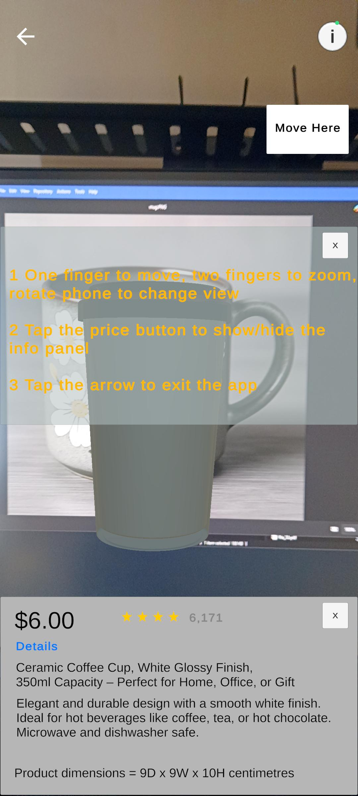

# AR Advertising

This is a project task for 7009ICT Griffith University

## Screenshot

  
  
  

## Video Demo

  <video src="https://github.com/user-attachments/assets/9140a43e-3539-4cae-bb4a-074ef6018b39">Watch the demo video</video>

## Technology uses
- Unity 2022.3.1f1
- Vuforia engine - 11.1.3

## Scan to download APK file

  

## How to run them
  Download the Vuforia Engine 11.1.3 from [here](https://drive.google.com/file/d/1Jr9kzAFyE5KQy4J8gpOsr3y6h4D9bBS2/view?usp=drive_link).

  
  <li>clone the project (make sure check out from master). </li>
  <li>Open Project using unity 2022.3.1f1. </li>
  <li>Add the downloaded .tgz file from package manager local file</li>
  <li>Build Setting -> Switch to Android</li>
  <li>Run the App!</li>

